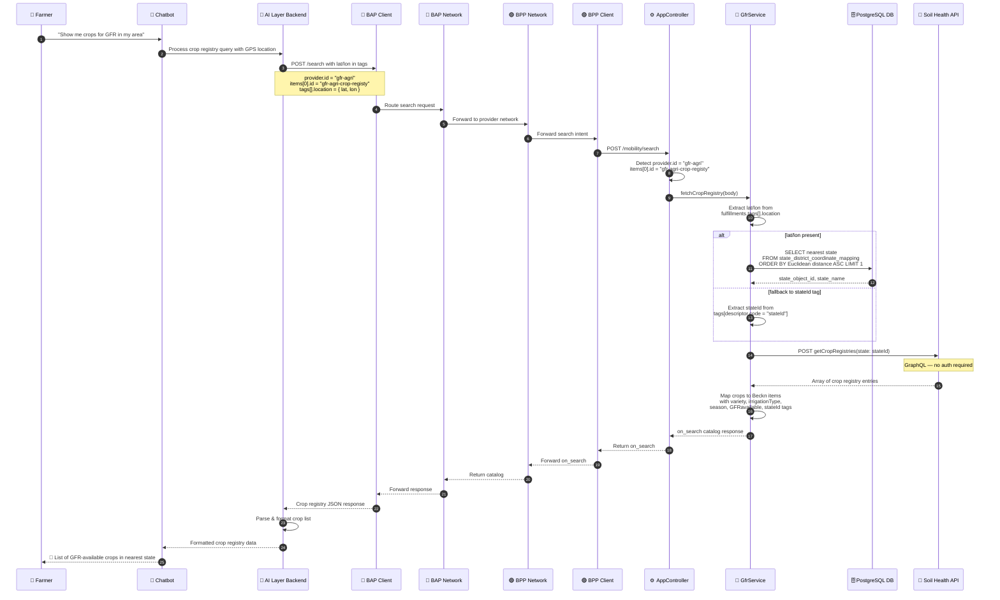
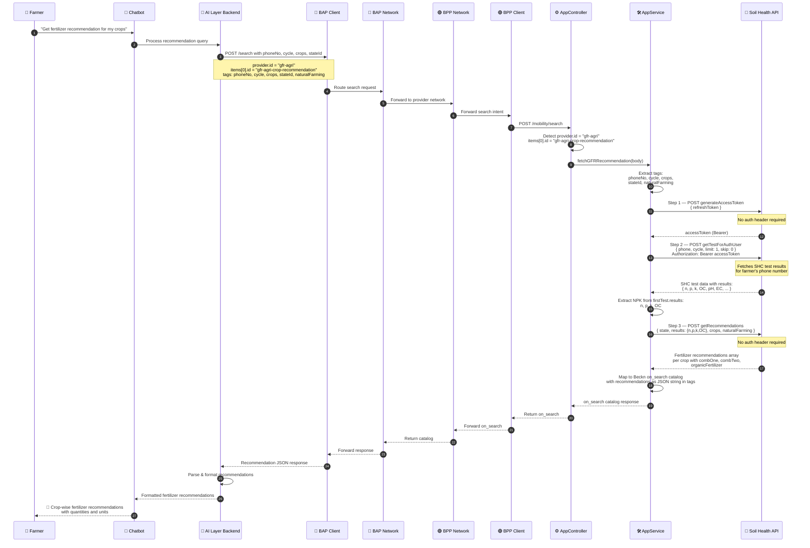

# GFR (General Fertilizer Recommendation) Integration Documentation

## Bharat Vistaar Chatbot - GFR Services via Beckn Protocol

· Version: 1.1.0  
· Domain: schemes:vistaar  
· Last Updated: Apr 2026 by Kenpath Technology Pvt Ltd  
· Author: Akshat Rana  
· Date: 2026-04-17

---

## Overview

The GFR Integration enables farmers using the Bharat Vistaar chatbot to:

1. **Browse the Crop Registry** — discover crops available for GFR in their nearest state (resolved from GPS coordinates)
2. **Get Crop Recommendations** — receive fertilizer recommendations based on their Soil Health Card (SHC) test results

The system uses the Beckn Protocol for decentralized network communication and integrates with the Soil Health Card API (`soilhealth4.dac.gov.in`) for crop registry and recommendation data.

### Key Components

- **GfrService** (`src/services/gfr/gfr.service.ts`): Handles crop registry flow — resolves state from lat/lon via DB, then fetches crop list
- **AppService** (`src/app.service.ts`): Handles recommendation flow — fetches access token, SHC test results (NPK), and calls getRecommendations
- **DatabaseService** (`src/services/weatherforecast/database.service.ts`): Queries `state_district_coordinate_mapping` table to resolve nearest state from GPS
- **Soil Health API** (`https://soilhealth4.dac.gov.in`): GraphQL API for crop registry and recommendations
- **PostGIS / PostgreSQL DB**: `weather_service` database with `state_district_coordinate_mapping` table

---

## Routing

Both flows share the same `/mobility/search` endpoint and are routed based on `provider.id` and `items[0].id`:

```
POST /mobility/search
  └── provider.id === "gfr-agri"
        ├── items[0].id === "gfr-agri-crop-registy"       → GfrService.fetchCropRegistry()
        └── items[0].id === "gfr-agri-crop-recommendation" → AppService.fetchGFRRecommendation()
```

---

## Flow 1: Crop Registry

### Sequence Diagram



### Step-by-Step Flow

1. BAP sends `POST /mobility/search` with `provider.id = "gfr-agri"` and `items[0].id = "gfr-agri-crop-registy"`
2. Controller routes to `GfrService.fetchCropRegistry()`
3. Service extracts `lat/lon` from `fulfillments[0].customer.person.tags[].location`
4. Queries `state_district_coordinate_mapping` table using Euclidean distance to find nearest `state_object_id`
5. Falls back to `stateId` tag if no lat/lon provided
6. Calls `getCropRegistries(state: $state)` on Soil Health API (no auth required)
7. Maps response into Beckn `on_search` catalog with crop details as item tags
8. Returns response synchronously

### DB Query

```sql
SELECT
    id,
    state_name,
    state_object_id,
    district_name,
    district_object_id,
    latitude,
    longitude,
    SQRT(
        POWER(latitude  - $1, 2) +
        POWER(longitude - $2, 2)
    ) AS distance
FROM state_district_coordinate_mapping
WHERE latitude  IS NOT NULL
  AND longitude IS NOT NULL
ORDER BY distance ASC
LIMIT 1;
```

### GraphQL Query

```json
{
  "query": "query GetCropRegistries($state: String) { getCropRegistries(state: $state) { id name variety irrigationType season splitdose GFRavailable combinedName state { _id name code } __typename } }",
  "variables": {
    "state": "<state_object_id>"
  }
}
```

---

## Flow 2: Crop Recommendation

### Sequence Diagram



### Step-by-Step Flow

1. BAP sends `POST /mobility/search` with `provider.id = "gfr-agri"` and `items[0].id = "gfr-agri-crop-recommendation"`
2. Controller routes to `AppService.fetchGFRRecommendation()`
3. Service extracts `phoneNo`, `cycle`, `crops`, `stateId`, `naturalFarming` from fulfillment tags
4. **Step 1** — Calls `generateAccessToken` with refresh token to get Bearer token
5. **Step 2** — Calls `getTestForAuthUser` with `phoneNo` + `cycle` to get SHC test results; extracts `n`, `p`, `k`, `OC` from `firstTest.results`
6. **Step 3** — Calls `getRecommendations` with `state`, `results` (NPK), `crops`, `naturalFarming` (no auth)
7. Returns Beckn `on_search` with recommendations serialized in tags

### GraphQL Queries

**Step 1 — Generate Access Token:**

```json
{
  "query": "query Query($refreshToken: String!) { generateAccessToken(refreshToken: $refreshToken) }",
  "variables": {
    "refreshToken": "<refresh_token>"
  }
}
```

**Step 2 — Get SHC Test Data:**

```json
{
  "query": "query GetTestForAuthUser(...) { getTestForAuthUser(phone: $phone, cycle: $cycle, limit: $limit, skip: $skip) { id computedID cycle results rdfValues ... } }",
  "variables": {
    "phone": "+917005334456",
    "cycle": "2025-26",
    "limit": 1,
    "skip": 0,
    "locale": "en"
  }
}
```

**Step 3 — Get Recommendations:**

```json
{
  "query": "query GetRecommendations($state: ID!, $results: JSON!, $district: ID, $crops: [ID!], $naturalFarming: Boolean) { getRecommendations(state: $state results: $results district: $district crops: $crops naturalFarming: $naturalFarming) }",
  "variables": {
    "state": "<stateId>",
    "results": { "n": 157, "p": 14.9, "k": 114.6, "OC": 1.4 },
    "crops": ["<cropId1>", "<cropId2>"],
    "naturalFarming": false
  }
}
```

---

## API Specifications

### Endpoint

**Dev:** `POST https://bap-client-playground-sandbox-vistaar.da.gov.in/search`

### Crop Registry Request

```bash
curl --location 'https://bap-client-playground-sandbox-vistaar.da.gov.in/search' \
--header 'Content-Type: application/json' \
--data '{
    "context": {
        "domain": "schemes:vistaar",
        "action": "search",
        "version": "1.1.0",
        "bap_id": "bap-network-playground-sandbox-vistaar.da.gov.in",
        "bap_uri": "https://bap-network-playground-sandbox-vistaar.da.gov.in",
        "bpp_id": "bpp-network-playground-sandbox-vistaar.da.gov.in",
        "bpp_uri": "https://bpp-network-playground-sandbox-vistaar.da.gov.in",
        "transaction_id": "{{$randomUUID}}",
        "message_id": "{{$randomUUID}}",
        "timestamp": "{{$timestamp}}",
        "ttl": "PT10M",
        "location": { "country": { "code": "IND" }, "city": { "code": "*" } }
    },
    "message": {
        "order": {
            "provider": { "id": "gfr-agri" },
            "items": [{ "id": "gfr-agri-crop-registy" }],
            "fulfillments": [{
                "customer": {
                    "person": {
                        "tags": [
                            { "location": { "lat": 21.6571, "lon": 82.1612 } }
                        ]
                    }
                }
            }]
        }
    }
}'
```

### Crop Recommendation Request

```bash
curl --location 'https://bap-client-playground-sandbox-vistaar.da.gov.in/search' \
--header 'Content-Type: application/json' \
--data '{
    "context": {
        "domain": "schemes:vistaar",
        "action": "search",
        "version": "1.1.0",
        "bap_id": "bap-network-playground-sandbox-vistaar.da.gov.in",
        "bap_uri": "https://bap-network-playground-sandbox-vistaar.da.gov.in",
        "bpp_id": "bpp-network-playground-sandbox-vistaar.da.gov.in",
        "bpp_uri": "https://bpp-network-playground-sandbox-vistaar.da.gov.in",
        "transaction_id": "{{$randomUUID}}",
        "message_id": "{{$randomUUID}}",
        "timestamp": "{{$timestamp}}",
        "ttl": "PT10M",
        "location": { "country": { "code": "IND" }, "city": { "code": "*" } }
    },
    "message": {
        "order": {
            "provider": { "id": "gfr-agri" },
            "items": [{ "id": "gfr-agri-crop-recommendation" }],
            "fulfillments": [{
                "customer": {
                    "person": {
                        "tags": [
                            { "descriptor": { "code": "stateId" }, "value": "63f9ce47519359b7438e76fa" },
                            { "descriptor": { "code": "crops" }, "value": ["66b5b6a605f96e8242f1a87f", "63f99fbd519359b7438a84ca"] },
                            { "descriptor": { "code": "naturalFarming" }, "value": false },
                            { "descriptor": { "code": "phoneNo" }, "value": "+917005334456" },
                            { "descriptor": { "code": "cycle" }, "value": "2025-26" }
                        ]
                    }
                }
            }]
        }
    }
}'
```

---

## Request Tags Reference

### Crop Registry Tags

| Tag Code   | Required         | Description               | Example                              |
| ---------- | ---------------- | ------------------------- | ------------------------------------ |
| `location` | Yes (or stateId) | GPS coordinates object    | `{ "lat": 21.6571, "lon": 82.1612 }` |
| `stateId`  | Fallback         | MongoDB ObjectId of state | `"63f9ce47519359b7438e76fa"`         |

### Crop Recommendation Tags

| Tag Code         | Required | Description                | Example                        |
| ---------------- | -------- | -------------------------- | ------------------------------ |
| `phoneNo`        | Yes      | Farmer's phone number      | `"+917005334456"`              |
| `cycle`          | Yes      | SHC cycle year             | `"2025-26"`                    |
| `stateId`        | Yes      | MongoDB ObjectId of state  | `"63f9ce47519359b7438e76fa"`   |
| `crops`          | Yes      | Array of crop registry IDs | `["66b5b6a605f96e8242f1a87f"]` |
| `naturalFarming` | No       | Natural farming flag       | `false`                        |

---

## Response Structures

### Crop Registry on_search

```json
{
  "context": { "action": "on_search", "...": "..." },
  "message": {
    "catalog": {
      "descriptor": { "name": "GFR Crop Registry" },
      "providers": [
        {
          "id": "gfr-agri",
          "descriptor": { "name": "GFR Crop Registry" },
          "items": [
            {
              "id": "<crop_id>",
              "descriptor": {
                "name": "aloe vera",
                "long_desc": "ಲೋಳೆಸರ (All Variety / Irrigated / Kharif)"
              },
              "tags": [
                {
                  "descriptor": { "code": "crop_details" },
                  "list": [
                    {
                      "descriptor": { "code": "variety" },
                      "value": "All Variety"
                    },
                    {
                      "descriptor": { "code": "irrigationType" },
                      "value": "Irrigated"
                    },
                    { "descriptor": { "code": "season" }, "value": "Kharif" },
                    {
                      "descriptor": { "code": "GFRavailable" },
                      "value": "Yes"
                    },
                    {
                      "descriptor": { "code": "stateId" },
                      "value": "<state_object_id>"
                    },
                    {
                      "descriptor": { "code": "stateName" },
                      "value": "KARNATAKA"
                    },
                    { "descriptor": { "code": "stateCode" }, "value": "29" }
                  ]
                }
              ]
            }
          ]
        }
      ]
    }
  }
}
```

### Crop Recommendation on_search

```json
{
  "context": { "action": "on_search", "...": "..." },
  "message": {
    "catalog": {
      "descriptor": { "name": "GFR Crop Recommendation" },
      "providers": [
        {
          "id": "gfr-agri",
          "descriptor": { "name": "GFR Crop Recommendation" },
          "items": [
            {
              "id": "gfr-recommendation",
              "descriptor": { "name": "Crop Recommendation" },
              "tags": [
                {
                  "descriptor": { "code": "recommendations" },
                  "display": true,
                  "list": [
                    {
                      "descriptor": { "code": "data" },
                      "value": "[{\"crop\":\"ಲೋಳೆಸರ...\",\"fertilizersdata\":[...],\"organicFertilizer\":{...}}]"
                    }
                  ]
                }
              ]
            }
          ]
        }
      ]
    }
  }
}
```

---

## Error Handling

| Error Code      | Scenario                  | Description                                  |
| --------------- | ------------------------- | -------------------------------------------- |
| `missing_input` | No lat/lon and no stateId | Location or stateId must be provided         |
| `missing_input` | No phoneNo                | Required for recommendation flow             |
| `missing_input` | No cycle                  | Required for SHC lookup                      |
| `db_error`      | DB query fails            | Cannot query nearest state from DB           |
| `no_data`       | No state found in DB      | No matching record in coordinate mapping     |
| `auth_error`    | Token fetch fails         | Cannot get access token from Soil Health API |
| `no_data`       | No SHC test found         | No soil health test for given phone/cycle    |
| `api_error`     | GFR API failure           | Soil Health API returned an error            |
| `no_data`       | Empty recommendations     | No recommendations for given crops/state/NPK |

---

## Network Participants

| Component      | ID                                               | URI                                                      | Env |
| -------------- | ------------------------------------------------ | -------------------------------------------------------- | --- |
| BAP (Seeker)   | bap-network-playground-sandbox-vistaar.da.gov.in | https://bap-network-playground-sandbox-vistaar.da.gov.in | Dev |
| BPP (Provider) | bpp-network-playground-sandbox-vistaar.da.gov.in | https://bpp-network-playground-sandbox-vistaar.da.gov.in | Dev |

---

## Environment Variables

| Variable               | Description                                                         |
| ---------------------- | ------------------------------------------------------------------- |
| `SOIL_HEALTH_BASE_URL` | Soil Health GraphQL API base URL (`https://soilhealth4.dac.gov.in`) |
| `IMD_DB_HOST`          | PostgreSQL host for `state_district_coordinate_mapping` table       |
| `IMD_DB_PORT`          | PostgreSQL port                                                     |
| `IMD_DB_USER`          | PostgreSQL user                                                     |
| `IMD_DB_PASSWORD`      | PostgreSQL password                                                 |
| `IMD_DB_NAME`          | Database name (`weather_service`)                                   |

---

## Related Documentation

- [IMD Weather Integration](./IMD.md)
- [PMFBY Flow](./PMFBY_FLOW.md)
- [Mandi Price Flow](./MANDI_PRICE_FLOW.md)
- [Beckn Protocol Specification v1.1.0](https://becknprotocol.io)

---

_Document maintained by Kenpath Technologies for Bharat Vistaar Project_
