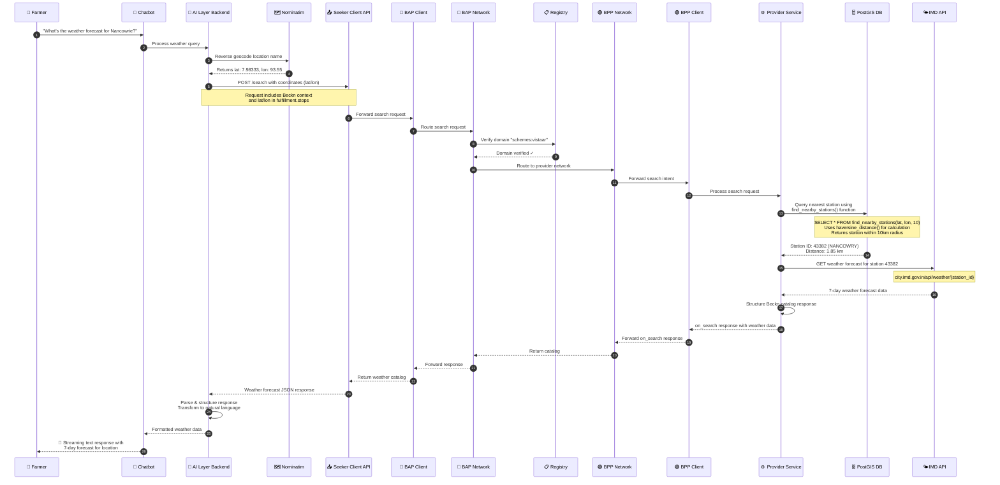

# Weather Forecast Integration Documentation

## Bharat Vistaar Chatbot - IMD Weather Services via Beckn Protocol

· Version: 1.1.0 
· Domain: schemes:vistaar 
· Last Updated: Jan 2026 by Kenpath Technology Pvt Ltd  
· Author: Akshat Rana 
· Date: 2026-01-18

---

## Overview

The Weather Forecast Integration enables farmers using the Bharat Vistaar chatbot to receive location-specific weather forecasts. The system leverages the Beckn Protocol for decentralized network communication and integrates with the India Meteorological Department (IMD) APIs for accurate weather data.

### Key Components

- **AI Layer Backend**: Handles user queries, performs reverse geocoding, and structures responses
- **Nominatim Service**: Provides reverse geocoding (location name to coordinates)
- **Beckn Network**: Facilitates decentralized communication between BAP and BPP
- **Provider Service**: Queries PostGIS for nearest weather station and fetches data from IMD API
- **PostGIS Database**: Database with custom Haversine distance functions for finding nearest weather stations within 10km radius
- **IMD API**: Source of official weather forecast data (city.imd.gov.in)

---

## System Flow



---

## API Specifications

### Seeker Client Search API

**Dev Endpoint:** `POST https://bap-client-playground-sandbox-vistaar.da.gov.in/search`

**Prod Endpoint:** `POST https://seeker-client-vistaar.da.gov.in/search`

**Headers:**
```
Content-Type: application/json
```

**Request Example:**

**DEV:**
```bash
curl --location 'https://bap-client-playground-sandbox-vistaar.da.gov.in/search' \
--header 'Content-Type: application/json' \
--data '{
    "context": {
        "domain": "schemes:vistaar",
        "action": "search",
        "version": "1.1.0",
        "bap_id": "bap-network-playground-sandbox-vistaar.da.gov.in",
        "bap_uri": "https://bap-network-playground-sandbox-vistaar.da.gov.in",
        "bpp_id": "bpp-network-playground-sandbox-vistaar.da.gov.in",
        "bpp_uri": "https://bpp-network-playground-sandbox-vistaar.da.gov.in",
        "transaction_id": "{{$randomUUID}}",
        "message_id": "{{$randomUUID}}",
        "timestamp": "{{$timestamp}}",
        "ttl": "PT10M",
        "location": {
            "country": {
                "code": "IND"
            },
            "city": {
                "code": "*"
            }
        }
    },
    "message": {
        "intent": {
            "category": {
                "descriptor": {
                    "name": "Weather-Forecast",
                    "code": "WFC"
                }
            },
            "fulfillment": {
                "stops": [
                    {
                        "location": {
                            "lat": "7.98333",
                            "lon": "93.55"
                        }
                    }
                ]
            }
        }
    }
}'
```

**PROD:**
```bash
curl --location 'https://seeker-client-vistaar.da.gov.in/search' \
--header 'Content-Type: application/json' \
--data '{
    "context": {
        "domain": "schemes:vistaar",
        "action": "search",
        "version": "1.1.0",
        "bap_id": "seeker-network-vistaar.da.gov.in",
        "bap_uri": "https://seeker-network-vistaar.da.gov.in",
        "bpp_id": "provider-network-vistaar.da.gov.in",
        "bpp_uri": "https://provider-network-vistaar.da.gov.in",
        "transaction_id": "{{$randomUUID}}",
        "message_id": "{{$randomUUID}}",
        "timestamp": "{{$timestamp}}",
        "ttl": "PT10M",
        "location": {
            "country": {
                "code": "IND"
            },
            "city": {
                "code": "*"
            }
        }
    },
    "message": {
        "intent": {
            "category": {
                "descriptor": {
                    "name": "Weather-Forecast",
                    "code": "WFC"
                }
            },
            "fulfillment": {
                "stops": [
                    {
                        "location": {
                            "lat": "7.98333",
                            "lon": "93.55"
                        }
                    }
                ]
            }
        }
    }
}'
```

### Network Participants

| Component | ID | URI | Env |
|-----------|-----|-----|-----|
| BAP (Seeker) | seeker-network-vistaar.da.gov.in | https://seeker-network-vistaar.da.gov.in | Prod |
| BPP (Provider) | provider-network-vistaar.da.gov.in | https://provider-network-vistaar.da.gov.in | Prod |
| BAP (Seeker) | bap-network-playground-sandbox-vistaar.da.gov.in | https://bap-network-playground-sandbox-vistaar.da.gov.in | Dev |
| BPP (Provider) | bpp-network-playground-sandbox-vistaar.da.gov.in | https://bpp-network-playground-sandbox-vistaar.da.gov.in | Dev |
---

## Request/Response Structures

### Search Request Structure

```json
{
    "context": {
        "domain": "schemes:vistaar",
        "action": "search",
        "version": "1.1.0",
        "bap_id": "seeker-network-vistaar.da.gov.in",
        "bap_uri": "https://seeker-network-vistaar.da.gov.in",
        "bpp_id": "provider-network-vistaar.da.gov.in",
        "bpp_uri": "https://provider-network-vistaar.da.gov.in",
        "transaction_id": "<uuid>",
        "message_id": "<uuid>",
        "timestamp": "<unix_timestamp>",
        "ttl": "PT10M",
        "location": {
            "country": {
                "code": "IND"
            },
            "city": {
                "code": "*"
            }
        }
    },
    "message": {
        "intent": {
            "category": {
                "descriptor": {
                    "name": "Weather-Forecast",
                    "code": "WFC"
                }
            },
            "fulfillment": {
                "stops": [
                    {
                        "location": {
                            "lat": "<latitude>",
                            "lon": "<longitude>"
                        }
                    }
                ]
            }
        }
    }
}
```

### On_Search Response Structure

The response follows the Beckn Protocol catalog structure:

```json
{
    "context": {
        "domain": "schemes:vistaar",
        "action": "on_search",
        "version": "1.1.0",
        "bpp_id": "provider-network-vistaar.da.gov.in",
        "bpp_uri": "https://provider-network-vistaar.da.gov.in",
        "bap_id": "seeker-network-vistaar.da.gov.in",
        "bap_uri": "https://seeker-network-vistaar.da.gov.in",
        "transaction_id": "<uuid>",
        "message_id": "<uuid>",
        "timestamp": "<unix_timestamp>",
        "ttl": "PT10M"
    },
    "message": {
        "catalog": {
            "descriptor": {
                "name": "Weather Forecast Service"
            },
            "providers": [
                {
                    "id": "provider-001",
                    "descriptor": {
                        "name": "IMD Weather Service"
                    },
                    "items": [
                        {
                            "id": "weather-item-001",
                            "descriptor": {
                                "name": "7-Day Weather Forecast"
                            },
                            "tags": [
                                {
                                    "descriptor": {
                                        "code": "2026-01-22",
                                        "name": "Current Day"
                                    },
                                    "list": [
                                        {
                                            "descriptor": {
                                                "code": "station_id",
                                                "name": "Station ID"
                                            },
                                            "value": "43382"
                                        },
                                        {
                                            "descriptor": {
                                                "code": "station_name",
                                                "name": "Station Name"
                                            },
                                            "value": "NANCOWRY"
                                        },
                                        {
                                            "descriptor": {
                                                "code": "rainfall",
                                                "name": "Rainfall"
                                            },
                                            "value": "7.00"
                                        },
                                        {
                                            "descriptor": {
                                                "code": "min_temp",
                                                "name": "Min Temperature"
                                            },
                                            "value": "23.4"
                                        },
                                        {
                                            "descriptor": {
                                                "code": "max_temp",
                                                "name": "Max Temperature"
                                            },
                                            "value": "29.8"
                                        },
                                        {
                                            "descriptor": {
                                                "code": "weather_condition",
                                                "name": "Weather Condition"
                                            },
                                            "value": "Generally cloudy sky with Light rain"
                                        }
                                    ]
                                }
                            ]
                        }
                    ]
                }
            ]
        }
    }
}
```

### Weather Parameters

| Parameter | Description | Example |
|-----------|-------------|---------|
| Station ID | Weather station identifier | 43382 |
| Station Name | Weather station name | NANCOWRY |
| Date | Forecast date | 2026-01-22 |
| Rainfall | Expected rainfall in mm | 7.00 |
| Min Temp | Minimum temperature in °C | 23.4 |
| Max Temp | Maximum temperature in °C | 29.8 |
| Min Humidity | Minimum humidity percentage | 88 |
| Max Humidity | Maximum humidity percentage | 89 |
| Weather Condition | Sky/weather description | Generally cloudy sky with Light rain |
| District | District name | NICOBAR |
| State | State/UT name | ANDAMAN AND NICOBAR ISLANDS UT |
| Distance | Distance from requested location in km | 1.85 |

---

## Data Processing

### AI Layer Response Processing

Once the AI Layer receives the response from the network API, it:

1. **Parses the JSON response** - Extracts catalog data from the Beckn response structure
2. **Validates structure** - Ensures all required fields are present
3. **Transforms data** - Converts structured tags into readable format
4. **Maps forecast days** - Organizes 7-day forecast data
5. **Formats units** - Adds appropriate units (°C, mm, %) to values
6. **Builds natural language response** - Creates user-friendly text
7. **Streams to chatbot** - Sends formatted response for display

### Sample Transformed Output

The AI layer transforms the structured response into a user-friendly format:

```
🌤️ Weather Forecast for Nancowrie, Nicobar (A&N Islands)

📍 Nearest Station: NANCOWRY (1.85 km away)

Today (Jan 22, 2026):
- Condition: Generally cloudy sky with Light rain
- Temperature: 23.4°C - 29.8°C
- Humidity: 88% - 89%
- Rainfall: 7.00 mm

Extended Forecast:
- Day 2-5: Cloudy with light rain, 23°C - 30°C
- Day 6-7: Mainly clear sky, 23°C - 30°C
```

---

## Provider Service Processing

### PostGIS Implementation

The Provider Service uses custom PostgreSQL functions to find the nearest weather station. The implementation uses the Haversine formula to calculate distances between coordinates.

#### Haversine Distance Function

Calculates the distance between two geographic coordinates using the Haversine formula:

```sql
CREATE OR REPLACE FUNCTION public.haversine_distance(
    lat1 numeric, 
    lon1 numeric, 
    lat2 numeric, 
    lon2 numeric
)
RETURNS numeric
LANGUAGE plpgsql
AS $function$
DECLARE
    r DECIMAL := 6371; -- Earth's radius in km
    dlat DECIMAL;
    dlon DECIMAL;
    a DECIMAL;
    c DECIMAL;
BEGIN
    dlat := RADIANS(lat2 - lat1);
    dlon := RADIANS(lon2 - lon1);
    a := SIN(dlat/2)^2 + COS(RADIANS(lat1)) * COS(RADIANS(lat2)) * SIN(dlon/2)^2;
    c := 2 * ASIN(SQRT(a));
    RETURN r * c;
END;
$function$;
```

#### Understanding the Haversine Formula

The **Haversine formula** is used to calculate the great-circle distance between two points on a sphere (in this case, Earth) given their latitude and longitude coordinates. This is essential for accurate distance calculations because Earth is not flat, and simple Euclidean distance would be inaccurate for geographic coordinates.

##### Why Use Haversine?

- **Spherical Geometry**: Earth is approximately a sphere, so we need spherical trigonometry to calculate accurate distances
- **Accuracy**: The Haversine formula provides accurate results for distances up to a few hundred kilometers
- **Great Circle Distance**: It calculates the shortest distance along the surface of a sphere (great circle path)

##### How the Formula Works

The Haversine formula calculates distance using the following steps:

1. **Convert differences to radians**:
   - `dlat = RADIANS(lat2 - lat1)` - Difference in latitude
   - `dlon = RADIANS(lon2 - lon1)` - Difference in longitude

2. **Calculate the Haversine of half the chord length (a)**:
   ```
   a = sin²(Δlat/2) + cos(lat1) × cos(lat2) × sin²(Δlon/2)
   ```
   This represents half the chord length between the two points on the unit sphere.

3. **Calculate the angular distance (c)**:
   ```
   c = 2 × arcsin(√a)
   ```
   This gives the central angle between the two points in radians.

4. **Calculate the actual distance**:
   ```
   distance = r × c
   ```
   Where `r = 6371 km` (Earth's mean radius), giving the distance in kilometers.

##### Step-by-Step Implementation Breakdown

```sql
-- Step 1: Convert coordinate differences to radians
dlat := RADIANS(lat2 - lat1);  -- Latitude difference in radians
dlon := RADIANS(lon2 - lon1);  -- Longitude difference in radians

-- Step 2: Calculate 'a' - the square of half the chord length
-- This uses the Haversine formula: a = sin²(Δlat/2) + cos(lat1) × cos(lat2) × sin²(Δlon/2)
a := SIN(dlat/2)^2 + COS(RADIANS(lat1)) * COS(RADIANS(lat2)) * SIN(dlon/2)^2;

-- Step 3: Calculate the angular distance 'c' in radians
-- c = 2 × arcsin(√a)
c := 2 * ASIN(SQRT(a));

-- Step 4: Multiply by Earth's radius to get distance in kilometers
-- distance = r × c, where r = 6371 km
RETURN r * c;
```

##### Example Calculation

For two points:
- Point 1: Nancowrie (lat: 7.98333, lon: 93.55)
- Point 2: Weather Station (lat: 7.98333, lon: 93.55) - same point for simplicity

The function would:
1. Calculate `dlat = 0` and `dlon = 0` (same coordinates)
2. Calculate `a = 0` (no distance)
3. Calculate `c = 0` (no angular distance)
4. Return `distance = 0 km`

For different coordinates, the formula accounts for Earth's curvature to provide accurate distance measurements.

##### Mathematical Formula

The complete Haversine formula can be written as:

```
d = 2r × arcsin(√[sin²(Δlat/2) + cos(lat1) × cos(lat2) × sin²(Δlon/2)])
```

Where:
- `d` = distance between the two points
- `r` = radius of the sphere (Earth = 6371 km)
- `lat1, lon1` = latitude and longitude of first point
- `lat2, lon2` = latitude and longitude of second point
- `Δlat = lat2 - lat1`
- `Δlon = lon2 - lon1`

#### Find Nearby Stations Function

Finds weather stations within a specified radius (default 1km, typically called with 10km) from the given coordinates:

```sql
CREATE OR REPLACE FUNCTION public.find_nearby_stations(
    input_lat numeric, 
    input_lon numeric, 
    radius_km numeric DEFAULT 1
)
RETURNS TABLE(
    station_id character varying, 
    station_name character varying, 
    district character varying, 
    state character varying, 
    distance_km numeric
)
LANGUAGE plpgsql
AS $function$
BEGIN
    RETURN QUERY
    SELECT 
        m.station_id,
        m.station_name,
        m.district,
        m.state,
        ROUND(haversine_distance(m.latitude, m.longitude, input_lat, input_lon)::numeric, 2)
    FROM imd_master_data m
    WHERE haversine_distance(m.latitude, m.longitude, input_lat, input_lon) <= radius_km
    ORDER BY haversine_distance(m.latitude, m.longitude, input_lat, input_lon);
END;
$function$;
```

#### Usage

The Provider Service calls the function with the GPS coordinates from the request:

```sql
SELECT * FROM find_nearby_stations(7.98333, 93.55, 10);
```

This returns the nearest weather station(s) within 10km, ordered by distance. The top result (closest station) is used to fetch weather data.

---

### PostGIS Implementation (Alternative)

If you want to use PostGIS spatial functions instead of the custom Haversine formula, here's the equivalent implementation:

#### Setup PostGIS (One-time)

First, enable PostGIS extension and add a spatial column:

```sql
-- Enable PostGIS extension
CREATE EXTENSION IF NOT EXISTS postgis;

-- Add spatial location column (if not exists)
ALTER TABLE imd_master_data 
ADD COLUMN IF NOT EXISTS location GEOGRAPHY(POINT, 4326);

-- Populate location column from existing lat/lon
UPDATE imd_master_data 
SET location = ST_MakePoint(longitude, latitude)::geography
WHERE location IS NULL AND latitude IS NOT NULL AND longitude IS NOT NULL;

-- Create spatial index for better performance
CREATE INDEX IF NOT EXISTS idx_location_spatial 
ON imd_master_data USING GIST(location);
```

#### PostGIS Function

```sql
CREATE OR REPLACE FUNCTION public.find_nearby_stations_postgis(
    input_lat numeric, 
    input_lon numeric, 
    radius_km numeric DEFAULT 10
)
RETURNS TABLE(
    station_id character varying, 
    station_name character varying, 
    district character varying, 
    state character varying, 
    distance_km numeric
)
LANGUAGE plpgsql
AS $function$
BEGIN
    RETURN QUERY
    SELECT 
        m.station_id,
        m.station_name,
        m.district,
        m.state,
        ROUND(
            ST_Distance(
                m.location,
                ST_MakePoint(input_lon, input_lat)::geography
            ) / 1000.0,  -- Convert meters to kilometers
            2
        ) as distance_km
    FROM imd_master_data m
    WHERE m.location IS NOT NULL
      AND ST_DWithin(
          m.location,
          ST_MakePoint(input_lon, input_lat)::geography,
          radius_km * 1000  -- Convert km to meters
      )
    ORDER BY m.location <-> ST_MakePoint(input_lon, input_lat)::geography
    LIMIT 100;  -- Limit results for performance
END;
$function$;
```

#### Usage

```sql
-- Find stations within 10km
SELECT * FROM find_nearby_stations_postgis(7.98333, 93.55, 10);

-- Find nearest station only
SELECT * FROM find_nearby_stations_postgis(7.98333, 93.55, 10) LIMIT 1;
```

#### Key Differences: PostGIS vs Haversine

| Feature | Haversine Function | PostGIS Function |
|---------|-------------------|------------------|
| **Data Type** | Uses `latitude`, `longitude` columns | Uses `location GEOGRAPHY` column |
| **Distance Calculation** | Custom Haversine formula | Built-in `ST_Distance()` |
| **Performance** | Good | Better with spatial index (GIST) |
| **Accuracy** | Haversine (sphere) | More accurate (ellipsoid) |
| **Setup** | Simple, no changes needed | Requires PostGIS extension + column migration |
| **Query Speed** | Fast | Faster for large datasets with spatial index |

#### When to Use Which?

- **Use Haversine** (current): Simple, works with existing lat/lon columns, no migration needed
- **Use PostGIS**: Better performance for large datasets, more accurate, supports advanced spatial queries

### IMD API Call

After obtaining the station ID, the Provider Service calls:

```
GET https://city.imd.gov.in/api/weather/{station_id}
```

This returns 7-day weather forecast data for the specified station.

---

## Error Handling

### Common Error Scenarios

| Error Type | HTTP Status | Description | User Message |
|------------|-------------|-------------|--------------|
| Invalid GPS | 400 | Malformed coordinates | "Please provide a valid location" |
| Geocoding Failed | 400 | Location not found in Nominatim | "Location not found. Please try a different location name" |
| No Station Found | 200 | No station within 10km radius | "Weather data not available for this remote area" |
| IMD Timeout | 504 | IMD API unresponsive | "Weather service temporarily unavailable" |
| Registry Failure | 503 | Domain verification failed | "Service temporarily unavailable" |

---

## Environment Configuration

| Environment | Seeker Client URL |
|-------------|-------------------|
| Production | https://seeker-client-vistaar.da.gov.in |

---

## Related Documentation

- [Beckn Protocol Specification v1.1.0](https://becknprotocol.io)
- [IMD Weather API Documentation](https://city.imd.gov.in)
- [PostGIS Spatial Queries](https://postgis.net/documentation/)
- [Haversine Formula](https://en.wikipedia.org/wiki/Haversine_formula)

---

*Document maintained by Kenpath Technologies for Bharat Vistaar Project*
