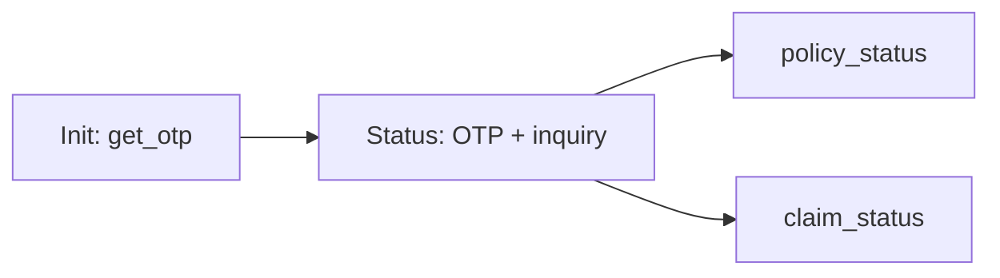
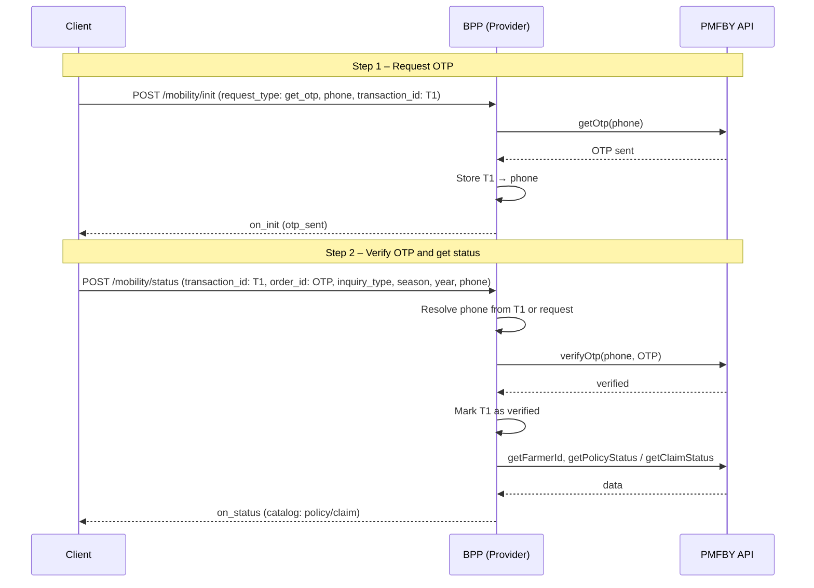

# PMFBY Flow: Get OTP (Init) → Verify OTP + Get Status (/status)

This document describes the end-to-end flow for PMFBY (Pradhan Mantri Fasal Bima Yojana) in the Beckn provider: OTP request via **init**, then OTP verification and policy/claim status via **status**.

· Version: 1.2.0  
· Domain: schemes:vistaar  
· Last Updated: Feb 2026 by Kenpath Technology Pvt Ltd  
· Author: Akshat Rana  
· Date: 2026-02-09

---

## Overview



1. **Init (get OTP only)**  
   Client calls **init** with `request_type: get_otp` and phone. Provider sends OTP to mobile and stores **`transaction_id` → phone**.

2. **Status (verify OTP + get policy/claim status)**  
   Client calls **status** with the **same `transaction_id`**, **`order_id` = OTP** (4–6 digits), and fulfillment tags: `inquiry_type`, `season`, `year`, `phone_number`. Provider verifies OTP, then fetches policy or claim status and returns it in **on_status** (including `message.catalog`).

3. **Transaction ID rule**  
   The **status** request must use the same **`transaction_id`** that was used in **init** get_otp. Phone can be omitted in status if it was already sent in get_otp (resolved from store).

---

## High-Level Sequence



---

## 1. Init – Get OTP (only)

**Endpoint:** `POST /mobility/init`  
**Condition:** `message.order.provider.id` = `"schemes-agri"` (or `pmfby-agri`) and `message.order.items[0].id` = `"pmfby"`.

**Request (relevant parts):**

- `context.transaction_id` — **Required.** Use the same value in the subsequent **status** call.
- `message.order.fulfillments[0].customer.person.tags`:
  - `request_type` = `"get_otp"`
  - `phone_number` (or use `contact.phone`)
- `message.order.fulfillments[0].customer.contact.phone` — fallback for phone.

**Behaviour:**

- Provider calls PMFBY **getOtp(phone)**.
- Provider stores **transaction_id → phone** (for use in status).
- Returns **on_init** with `code: "otp_sent"` and success message (or `otp_send_failed` on error).

**Note:** `request_type: verify_otp` is **not** supported on init. If sent, the provider returns `code: "use_status_api"` and instructs the client to use **POST /mobility/status** for OTP verification and status.

---

## 2. Status – Verify OTP and get policy/claim status

**Endpoint:** `POST /mobility/status`  
**Condition:** Same PMFBY provider/item (e.g. `provider.id` = `"schemes-agri"` or `"pmfby-agri"`, `items[0].id` = `"pmfby"`).

**Request (relevant parts):**

- `context.transaction_id` — **Required.** Must be the same as used in **init** get_otp.
- `message.order_id` — **Required.** The OTP received on mobile (4–6 digits). Treated as OTP for PMFBY status requests.
- `message.order.fulfillments[0].customer.person.tags`:
  - `inquiry_type` = `"policy_status"` or `"claim_status"`
  - `season` (e.g. Kharif / Rabi / Summer)
  - `year`
  - `phone_number` (optional if transaction_id was used in get_otp; else required)
- `message.order.fulfillments[0].customer.contact.phone` — fallback for phone.

**Where to send the OTP:** Put the OTP (4–6 digits) in **`message.order_id`**. The provider treats this as the OTP for PMFBY status requests.

**Request body example (POST /mobility/status):**

```json
{
  "context": {
    "domain": "schemes:vistaar",
    "action": "status",
    "transaction_id": "T1-same-as-init-get_otp",
    "message_id": "msg-123",
    "timestamp": "2026-02-09T10:00:00.000Z",
    "bpp_id": "your-bpp-id"
  },
  "message": {
    "order_id": "123456",
    "order": {
      "id": "order-1",
      "provider": {
        "id": "schemes-agri"
      },
      "items": [
        {
          "id": "pmfby"
        }
      ],
      "fulfillments": [
        {
          "customer": {
            "person": {
              "tags": [
                { "descriptor": { "code": "inquiry_type" }, "value": "policy_status" },
                { "descriptor": { "code": "season" }, "value": "Kharif" },
                { "descriptor": { "code": "year" }, "value": "2024" },
                { "descriptor": { "code": "phone_number" }, "value": "9876543210" }
              ]
            },
            "contact": {
              "phone": "9876543210"
            }
          }
        }
      ]
    }
  }
}
```

- **`message.order_id`** = OTP (4–6 digits) received after get_otp.
- **`context.transaction_id`** = same value as in init get_otp.
- **`inquiry_type`**: `"policy_status"` or `"claim_status"`.
- **`season`**: e.g. `"Kharif"`, `"Rabi"`, `"Summer"`.
- **`year`**: e.g. `"2024"`.
- **`phone_number`** / **`contact.phone`**: optional if same `transaction_id` was used in get_otp; otherwise required.

**Behaviour:**

1. **Transaction ID**  
   If `transaction_id` is missing, provider returns **on_status** with `code: "missing_transaction_id"` and does not call PMFBY.

2. **Phone**  
   Phone is resolved from **pmfbyOtpTransactionStore(transaction_id)** or from the request. If not found, returns error.

3. **Verify OTP**  
   Provider calls PMFBY **verifyOtp(phone, order_id)**. If verification fails, returns **on_status** with `code: "otp_verification_failed"` and does not fetch policy/claim.

4. **Fetch status**  
   On success: provider adds **transaction_id** to the verified set, then **getFarmerId(phone)** → **getPmfbyToken()** → **getPolicyStatus** or **getClaimStatus** (based on `inquiry_type`), maps with pmfbyPolicyGenerator / pmfbyClaimStatusGenerator.

5. **Response**  
   Returns **on_status** with `message.order` (state COMPLETED, tag `otp_verified`) and **message.catalog** containing the policy or claim data.

---

## When transaction_id is missing or invalid

| Case | Response |
|------|----------|
| **Missing transaction_id** on status | `on_status` with `code: "missing_transaction_id"`, `short_desc`: "Transaction ID is missing. Include context.transaction_id from get_otp in the request." |
| **Missing inquiry_type / season / year** | `on_status` with `code: "missing_input"` and message that these tags are required. |
| **OTP verification fails** | `on_status` with `code: "otp_verification_failed"` and reason from PMFBY. |

---

## State Stored by the Provider

| Store | Purpose |
|-------|--------|
| **pmfbyOtpTransactionStore** | Map `transaction_id` → `phone` after get_otp (used in status to resolve phone). |
| **pmfbyVerifiedTransactions** | Set of `transaction_id`s that have completed OTP verification via **status**. Optional **search** is allowed only for these IDs. |

Both are in-memory (per process). Restart clears them.

---

## Optional: Search (after status)

If the client has already received policy/claim data in **on_status**, no further call is needed. If the client still wants to use **search** (e.g. for a different inquiry_type/season/year), it may call **POST /mobility/search** with the **same transaction_id** after that ID has been verified (via **status**). Search is allowed only for `transaction_id`s in **pmfbyVerifiedTransactions**.

---

## Quick Reference

| Step | Endpoint | What to send | transaction_id |
|------|----------|--------------|-----------------|
| 1 | POST /mobility/init | request_type: **get_otp**, phone | T1 (chosen by client) |
| 2 | POST /mobility/status | order_id: **OTP**, inquiry_type, season, year, phone (optional if T1 used in step 1) | **Same T1** |

Response of step 2 is **on_status** with `message.catalog` (policy or claim data). No separate verify_otp on init; no separate search required unless client wants an additional search.
